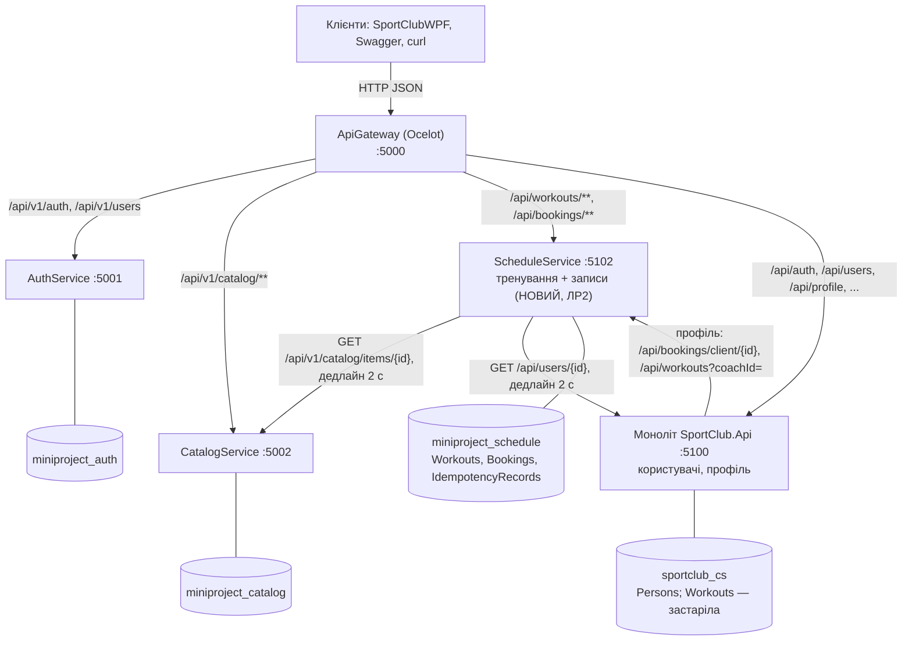

# Діаграма компонентів після ЛР2 (Container, C4)

```mermaid
flowchart TB
    client["Клієнти: SportClubWPF, Swagger, curl"]
    gw["ApiGateway (Ocelot)<br/>:5000"]
    auth["AuthService :5001"]
    catalog["CatalogService :5002"]
    mono["Моноліт SportClub.Api :5100<br/>користувачі, профіль"]
    sched["ScheduleService :5102<br/>тренування + записи (НОВИЙ, ЛР2)"]

    authdb[("miniproject_auth")]
    catdb[("miniproject_catalog")]
    monodb[("sportclub_cs<br/>Persons; Workouts — застаріла")]
    schdb[("miniproject_schedule<br/>Workouts, Bookings, IdempotencyRecords")]

    client -->|HTTP JSON| gw
    gw -->|"/api/v1/auth, /api/v1/users"| auth
    gw -->|"/api/v1/catalog/**"| catalog
    gw -->|"/api/workouts/**, /api/bookings/**"| sched
    gw -->|"/api/auth, /api/users, /api/profile, ..."| mono

    sched -->|"GET /api/v1/catalog/items/{id}, дедлайн 2 с"| catalog
    sched -->|"GET /api/users/{id}, дедлайн 2 с"| mono
    mono -->|"профіль: /api/bookings/client/{id}, /api/workouts?coachId="| sched

    auth --- authdb
    catalog --- catdb
    mono --- monodb
    sched --- schdb
```

Зв'язків між базами немає: Schedule бачить користувачів і каталог лише через API, а в записах зберігає знімки.
